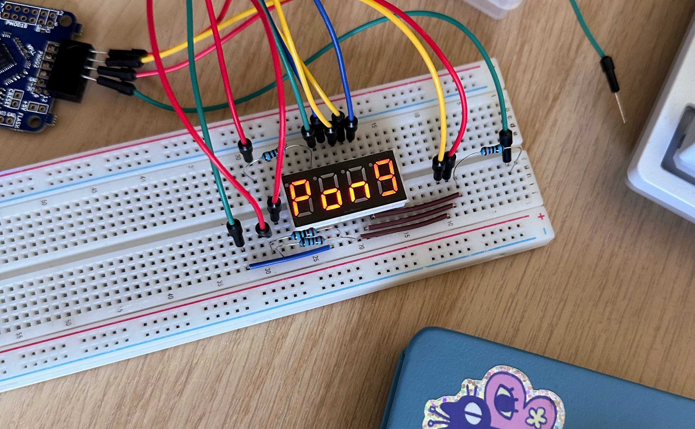
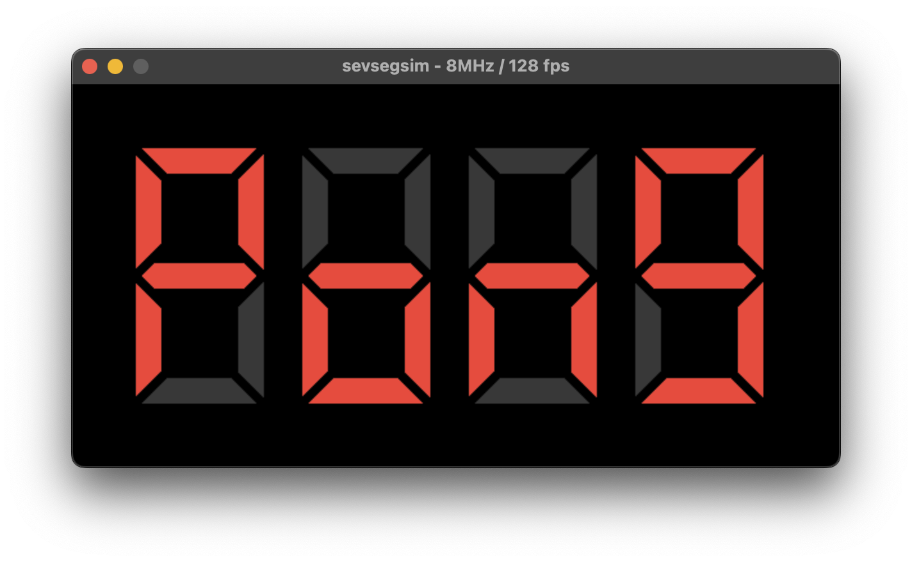

# sevsegsim

A little proving ground for and demonstration of
[Chryse](https://github.com/chryse-hdl/chryse), particularly its `cxxsim` mode.

Here's the gateware ([top](src/main/scala/ee/kivikakk/sevsegsim/Top.scala), [7-seg renderer](src/main/scala/ee/kivikakk/sevsegsim/SevSeg.scala)) running on an iCEBreaker:

(The gateware's not well-written, vabandust!)

And here's the same gateware (plus [blackbox
definition](src/main/scala/ee/kivikakk/sevsegsim/CXXRTLTestbench.scala), [main
loop](cxxsim/main.cc), [renderer](cxxsim/render.cc), [do-nothing blackbox
impl](cxxsim/testbench.cc)) running in simulation:

`sbt "run build ice40 -p"` builds for iCE40 and programs the board.

`sbt "run cxxsim"` builds and runs the C++ simulation.

`sbt "run cxxsim -v out.vcd"` also generates a VCD:

(The gateware responds to UBTN presses by rotating the output 180°.)
