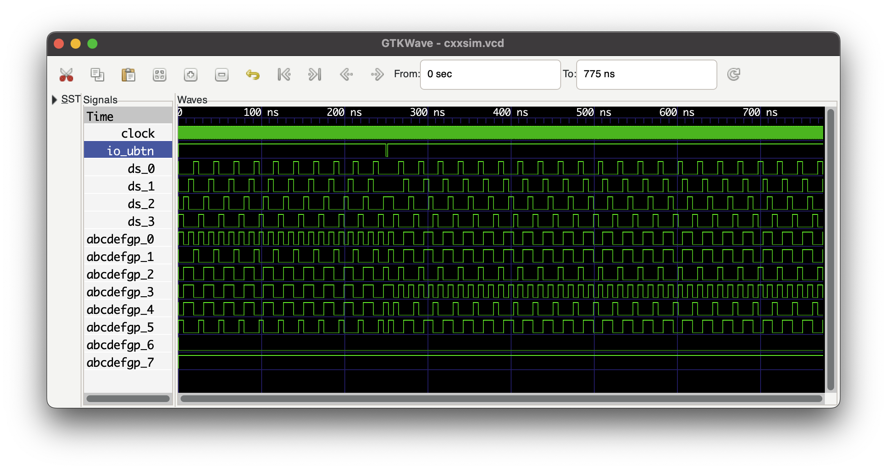

# sevsegsim

A little proving ground for and demonstration of [Chryse].

[Chryse]: https://github.com/chryse-hdl/chryse

Here's the gateware ([top], [7-seg renderer], [4-digit flipper]) running on an
iCEBreaker:

[top]: src/main/scala/ee/kivikakk/sevsegsim/Top.scala
[7-seg renderer]: src/main/scala/ee/kivikakk/sevsegsim/SevSeg.scala
[4-digit flipper]: src/main/scala/ee/kivikakk/sevsegsim/Flipper.scala

(The gateware's not well-written, vabandust!)

And here's the same gateware (plus [blackbox definition], [SDL main loop],
[segment renderer], [simulation thread], [blackbox impl]) running in simulation:

[blackbox definition]: src/main/scala/ee/kivikakk/sevsegsim/CXXRTLTestbench.scala
[SDL main loop]: cxxsim/main.cc
[segment renderer]: cxxsim/render.cc
[simulation thread]: cxxsim/SimThread.cc
[blackbox impl]: cxxsim/Testbench.cc

`sbt run` will show help info.

`sbt "run build -b icebreaker -p"` builds for [iCEBreaker] and programs the board.

[iCEBreaker]: https://www.crowdsupply.com/1bitsquared/icebreaker-fpga

`sbt "run cxxsim"` builds and runs the C++ simulation.

`sbt "run cxxsim -v out.vcd"` also generates a VCD:

(The gateware responds to UBTN presses by rotating the output 180°.)
